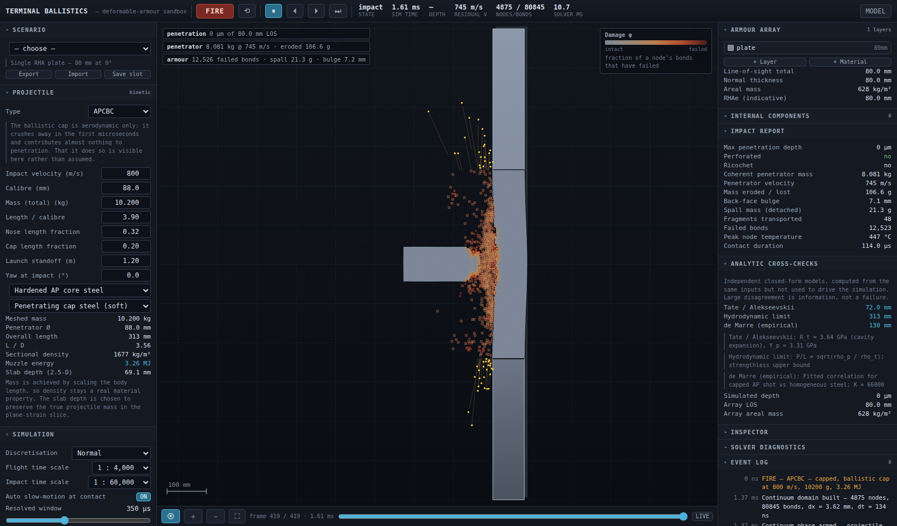

# Terminal Ballistics Sandbox

A real-time, interactive terminal-ballistics simulator: deformable armour,
dynamic projectiles, and a rendering layer that only ever draws what the solver
computed.

The armour is a **peridynamic continuum**, not a sprite. The projectile is a
meshed body that erodes, upsets, shatters or ricochets according to its own
material state. The penetration channel is opened by the interaction over
hundreds of solver steps, and whatever shape is left at the end is the state
the solver arrived at — it can be paused, scrubbed frame by frame, and probed
node by node.



---

## Running it

Nothing to install — plain ES modules, no framework, no dependencies. They need
an HTTP origin, so:

```bash
npm start           # or: python3 -m http.server 8080
# then open http://localhost:8080/
```

If you would rather have one file you can double-click:

```bash
npm run build       # writes dist/terminal-ballistics.html
```

That build inlines every module and runs from `file://`. It also renders
`docs/model.html` and regenerates the home-screen icons.

## Publishing it

The site is static — `index.html` plus the `src/` module tree — so GitHub Pages
serves it with no build step. Every path is relative, so it works from a
repository subdirectory with no base-path configuration.

**Settings → Pages → Source → Deploy from a branch → `main` / `(root)`.**
Pushing to `main` then updates the site directly.

`.github/workflows/deploy.yml` runs the headless physics checks and the build
on every push, so a solver regression shows up before anyone opens the site. It
can also do the publishing itself: set **Source → GitHub Actions**, make `main`
the default branch (the `github-pages` environment only accepts deployments
from it), and add the repository variable `PAGES_VIA_ACTIONS = true`. Until
then the deploy job is skipped rather than left to fail.

On a phone, **Share → Add to Home Screen** installs it as a standalone app
(there is a web manifest and an apple-touch-icon), which gets rid of the Safari
chrome and gives the viewport the full screen.

## Performance and devices

The simulation is the same on every device. What changes with the hardware is
the node budget and how much simulated time fits into each frame — never the
solver, the constitutive model or the time step.

- **Device tier** is *measured*, not sniffed. Safari exposes no useful signal
  for ranking Apple silicon, so a short latency-bound benchmark shaped like the
  solver's bond loop runs at start-up and picks the tier. It is re-checked
  between shots against the sub-step count the device actually sustained, so a
  misjudged device corrects itself after one run. Override it in
  **Simulation → Device profile**.
- **The node field is drawn on the GPU** (WebGL 2, falling back to WebGL 1 then
  Canvas 2D). Positions and one scalar per node are uploaded per frame; colour
  ramps live in a texture, so switching field mode costs nothing and no
  per-node colour arithmetic happens in JavaScript. Canvas 2 D remains as the
  fallback path and after a context loss.
- **The renderer allocates nothing per frame** and the frame recorder is a ring
  of preallocated typed arrays sized to a memory budget rather than a frame
  count.
- **The governor** trims pixel ratio and sub-steps per frame to hold the frame
  time. Current tier, backend, pixel ratio and benchmark score are all shown in
  **Solver diagnostics**.

---

## What it does

Press **FIRE**. The projectile leaves the muzzle as a rigid body, flies with
drag and gravity, discards its sabot if it has one, and when it comes within a
few lattice spacings of the array the world hands its exact state — position,
orientation, velocity, geometry, per-part materials — to the continuum solver.
From that moment the impact is resolved at roughly 10⁻⁷ s per step.

You can:

- design layered armour arrays — thickness, material, slope, air gaps,
  lamination, and 16 armour materials from RHA to boron carbide;
- configure ten projectile types (AP, APC, APCBC, APHE, APCR, APDS, APFSDS,
  HE, HEAT, HESH), each with its own cross-section, per-part materials and
  fuzing;
- watch the projectile travel, contact, deform and erode in slow motion;
- watch the plate crater, flow, bulge, crack, spall and open a channel;
- place internal components and see which of them get hit;
- pause, step forward, step backward, scrub any recorded frame, and click any
  individual node to read its damage, plastic strain, temperature, stress and
  displacement;
- switch the field between material, damage, plastic strain, temperature,
  velocity and virial stress;
- save and load scenarios as JSON.

Change the plate thickness, the slope, the material, the projectile type, the
velocity or the mass, and the outcome changes because the physics changed —
not because a lookup table said so.

---

## Keyboard

| key | action |
|---|---|
| `space` | play / pause |
| `F` | fire |
| `R` | reset |
| `.` / `,` | step one frame forward / back |
| `1`–`6` | field mode |
| `+` / `-` / `0` | zoom in / out / fit |

Drag to pan, wheel or pinch to zoom, click to inspect. On a touch screen the
panels collapse behind the Setup / Results / Viewport tabs, one-finger drag
pans, two fingers pinch, and a tap inspects.

---

## Architecture

```
src/
  core/        math, units, event log, frame recorder
  materials/   material database + peridynamic calibration
  sim/
    pd/        domain (nodes, bonds, lattice) and solver (forces, contact)
    scene      layers, modules, ray casting
    projectile rigid flight regime
    projectileTypes  geometry + behaviour per round
    fragments  ballistic transport of promoted spall
    explosive  Gurney/PER energy release
    internals  component vulnerability
    analytics  independent closed-form cross-checks
    world      regime orchestration
  render/      camera, palette, 2.5-D renderer
  ui/          panels, controls, presets
tools/         headless harnesses + single-file build
docs/MODEL.md  assumptions, equations, limitations
```

The dependency direction is one-way: `ui → render → sim → materials → core`.
The renderer reads simulation state and never writes it. Each subsystem is
replaceable on its own — `docs/MODEL.md` §9 lists what each one could be
swapped for.

### Headless harnesses

The physics can be exercised without a browser:

```bash
node tools/smoke.mjs apcbc normal    # full run, verdict, event log, energy audit
node tools/probe.mjs apcbc           # step-level solver internals
node tools/audit.mjs                 # energy-conservation audit
node tools/sweep.mjs 0.2 1 0.25      # parameter sweep across three cases
```

---

## Read this before quoting a number

`docs/MODEL.md` is the full account. The short version:

- **Nothing here is validated against firing trials.** The material data are
  representative handbook values for a class of material.
- The model is a **plane-strain 2-D section** with a single scalar correction
  for out-of-plane confinement. Genuinely three-dimensional behaviour is not
  captured.
- Bond-based peridynamics is **locked to a Poisson ratio of 1/3**.
- Bond failure uses the material's **measured failure strain**, not the
  classical fracture-energy critical stretch, because the latter is
  horizon-dependent and at practical lattice spacings makes every metal
  brittle. This is a documented departure, explained in §3.4.
- The explicit scheme is **not exactly energy conserving**. The drift is
  measured every step and displayed in the Solver diagnostics panel. Beyond
  roughly ±35 % a run should be read as qualitative.
- **Shaped-charge liner collapse is not simulated** — the jet's velocity
  gradient is imposed from the PER model, and the lattice cannot resolve a real
  jet diameter.

Closed-form engineering models (Tate/Alekseevskii, the hydrodynamic limit, de
Marre) are computed alongside every shot and shown next to the simulated
answer. They do not drive the simulation. Where they disagree with it, that
disagreement is information.

---

## Licence and provenance

Material properties, empirical correlations and the peridynamic formulation are
attributed in `docs/MODEL.md` §1 and §8, and per-entry in
`src/materials/database.js`.
